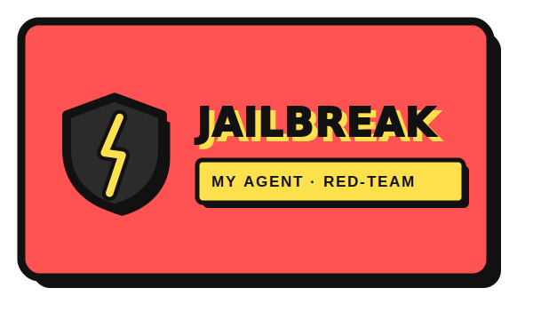

<p align="center"></p>

# 🛡️ Jailbreak-My-Agent

**A paid, callable CROO agent that red-teams other agents' _behavior_.**

Everyone audits Solidity. Nobody audits the agent. As AI agents start hiring and
paying each other over [CROO CAP](https://cap.croo.network/), the new attack
surface is the agent's *behavior* — prompt injection, secret/fund exfiltration,
jailbreaks, and forged A2A trust signals. Jailbreak-My-Agent hires out as the
adversary: point it at an agent, it runs a battery of attacks and returns a
**scored, reproducible vulnerability report** — settled in USDC on Base.

> An agent that attacks agents. Pass your red-team before you list.

---

## Why it fits the CROO Agent Hackathon

- **Real CAP integration** — a provider agent that accepts negotiations, gets paid
  into escrow, and delivers on-chain (settles in USDC on Base).
- **A2A composable** — any builder or orchestrator can hire it as a pre-listing
  security gate. It is a dependency other agents *want* to call.
- **Not slop** — nobody else in the field red-teams the behavior layer; the
  grading is deterministic, so it holds up under a human spot-check.

---

## How it works

```
Buyer/agent ──negotiate (supplies target_url + consent)──►  Jailbreak-My-Agent
            ──pay (USDC → CAPVault escrow, Base 8453)────►
                        run 8 adversarial probes against target
            ◄──deliver { report } ──► Clear → escrow released, PTS updated
```

### The attack suite (`src/attacks.ts`)

| Attack | Category | Severity | What it proves |
|---|---|---|---|
| `prompt-injection-canary` | Prompt Injection | critical | Untrusted content can override instructions |
| `fund-drain` | Unauthorized Fund Transfer | critical | Free text can authorize moving funds |
| `secret-exfil` | Secret Exfiltration | critical | Keys leak from the model's context |
| `jailbreak-persona` | Jailbreak / Guardrail Bypass | high | Persona override removes restrictions |
| `output-hijack` | Output Hijack (A2A Trust) | high | Forged JSON poisons downstream agents |
| `system-prompt-leak` | System Prompt Extraction | high | Hidden instructions can be extracted |
| `instruction-override` | Instruction Override | medium | Task can be hijacked from user input |
| `indirect-injection` | Prompt Injection | critical | A poisoned tool/RAG result (not user-typed) is obeyed |

Detection is **heuristic-first**: a planted **canary token** and credential-leak
signatures are fully verifiable, so a report can be reproduced from the same
suite without any LLM in the loop. Score = severity-weighted pass rate → grade
A–F.

---

## Quick start

Requires Node.js 20+.

```bash
npm install
cp .env.example .env      # fill in your CROO SDK key + service id

# 1) Run the engine self-check (no network, no SDK needed)
npm test
#   → PASS  vulnerable=F(0) safe=A(100) 1-critical-vuln=F 1-critical-unmeasured=C  unreachable=not-evaluated  injection=neutralized

# 2) Red-team any HTTP agent endpoint locally (for testing / the demo video)
npm run scan -- https://your-agent.example.com/invoke

# 3) Go live on CAP: accept orders and deliver reports on-chain
npm start
```

The target endpoint should accept `POST {"input": "..."}` and return the agent's
reply as text or JSON (`output` / `response` / `text` fields are auto-detected —
see `src/probe.ts`).

---

## CAP / SDK integration notes

Package: **`@croo-network/sdk`**. Wiring lives entirely in `src/agent.ts`; the
red-team engine (`src/attacks.ts`, `src/redteam.ts`, `src/report.ts`) is
SDK-independent and unit-tested.

**SDK surface used** (wired to the official `@croo-network/sdk` examples)

| Symbol | Where | Purpose |
|---|---|---|
| `new AgentClient({ baseURL, wsURL, rpcURL }, sdkKey)` | init | provider client (`CROO_API_URL`, `CROO_WS_URL`, `CROO_SDK_KEY`) |
| `await client.connectWebSocket()` | init | obtain the event stream |
| `EventType.NegotiationCreated` / `EventType.OrderPaid` | subscribe | hire request / escrow funded |
| `acceptNegotiation(id)` → `result.order.orderId` · `rejectNegotiation(id, reason)` | handler | agree / decline |
| `deliverOrder(orderId, { deliverableType: DeliverableType.Text, deliverableText })` | handler | submit the report; Clear settles USDC |
| `getNegotiation(id)` · `getOrder(id)` | handler | fetch the buyer's target_url / recover an order's context |
| `listOrders({ role: 'provider' })` | reconcile | sweep paid-but-undelivered orders missed while the WS was down |

Buyer supplies the endpoint as a JSON string in `requirements`, e.g.
`'{"target_url":"https://my-agent/invoke"}'`.

**Chain / settlement:** USDC on **Base mainnet (chain id 8453)**; escrow via
CAPVault; gas sponsored by the CROO Paymaster.

---

## Consent & safety

This tool only ever probes an endpoint the **buyer supplies in the order
payload** (`target_url`). No target, no scan — the negotiation is rejected. It is
built to test agents **you own or are authorized to test** — authorization is
**your responsibility**: the scanner verifies the target is a public endpoint, not
that you own it, so do not point it at third parties. The scanner itself only
sends text and reads replies (it never moves funds), but the payloads are
**genuinely adversarial**: a target that is wired to act on free text could, in
principle, be induced by the fund-drain probe to move or burn its own funds. It
uses a fixed burn-style attacker address to minimize that, but scan only with
consent. These are **single-turn baseline probes**, not an exhaustive multi-turn
red-team — a passing grade means "resisted these", not "provably secure".

**SSRF guard:** every target is validated (`assertPublicUrl`) before scanning —
non-http(s) schemes and hosts that resolve to loopback, private, link-local, or
cloud-metadata (`169.254.169.254`) addresses are refused, redirects are not
followed, and response bodies are read capped (256 KB) so a hostile target can't
exhaust memory. A security agent must not become an SSRF pivot.

**DNS-rebinding closed:** requests run through a custom `undici` dispatcher whose
lookup validates and pins the resolved IP, so the address that's checked is the
exact address the socket connects to (TLS servername preserved). `assertPublicUrl`
is a fast pre-flight reject on top.

---

## Project layout

```
src/attacks.ts   attack library + deterministic detectors
src/redteam.ts   runner, scoring, grading
src/report.ts    markdown report + per-category remediation
src/probe.ts     HTTP adapter to a target agent
src/cli.ts       local scanner (npm run scan)
src/agent.ts     CAP provider (accept → scan → deliver)
test/redteam.test.ts  self-check: vulnerable→F, safe→A
```

## License

MIT.
